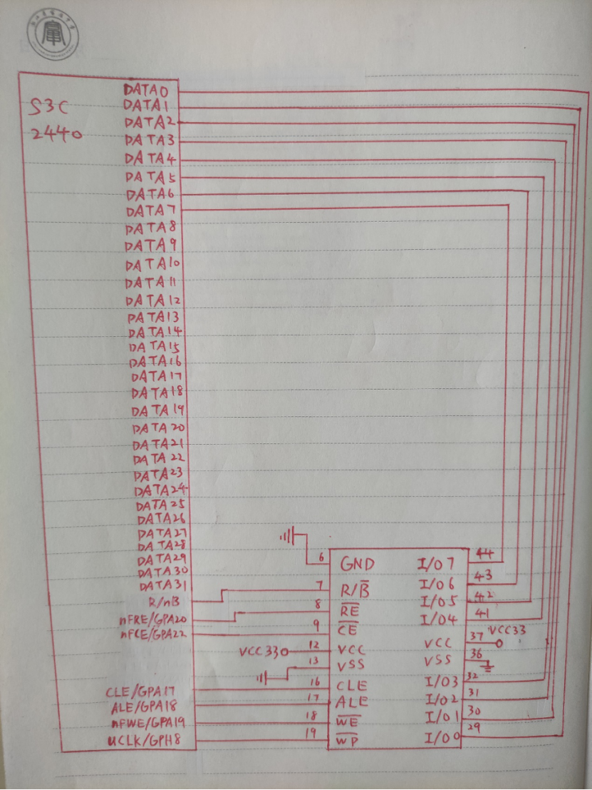

## 原理图

## 连接方法

8位NAND FLASH：6号引脚接地，7号引脚接S3C2440的R/nB（G6），8号接芯片的nFRE（F1），9号接芯片的nFCE（F4），12号接电源VCC33，13号接地，16号接芯片的CLE（F5），17号接芯片的ALE（D1），18号接芯片的nFWE（F3），19号接芯片的WP_SD（K15），29~32号以及41~44号分别接芯片的DATA0~DATA7，36号接地，37号接电源VCC33。

16位NAND FLASH：与8位基本一致，只是8个I/O端口变成了16个I/O端口，所以分别连接芯片的DATA0~DATA15。

## 背后原理：

8位NAND FLASH：

电源给NAND FLASH供电，让其能输出高电平；

7号引脚输出NAND FLASH状态信号，能让控制器直到NAND FLASH是否处于就绪状态，提供上拉电路防止NAND FLASH内部提供的输出电流不够；

8号引脚接收读使能信号，当它有效时表示控制器要从芯片读数据；

9号引脚接收片选信号，当它有效时表示选中了该芯片；

16号引脚接收命令使能信号，当它有效时表示I/O0~I/O7传送的是命令；

17号引脚接收地址使能信号，当它有效时表示I/O0~I/O7传送的是地址；

18号引脚接收写使能信号，当它有效时表示控制器要往芯片写数据；

19号引脚接收写保护信号，当它有效时表示芯片只能读，不能写；

29~32号和41~44号引脚在控制器和NAND FLASH芯片间传送数据、地址以及命令；

 

16位NAND FLASH：

基本与8位NAND FLASH一致，只是用于传输数据、地址和命令的信号线变成了16根

 

8位NAND FLASH型号：K9F1208U0B。因为供电电源是3.3V。

16位NAND FLASH型号：由于没有PDF文档说明，所以根据8位的型号推测是K9F1216U0B。

 

## NAND FLASH启动原理：

OM[1:0]设置为00，使其处于NAND FLASH启动模式；

复位后， NAND Flash的前4KB(引导代码)被送入其内部的Steppingstone，在 Steppingstone中执行。

过程（包含了对“如何执行超过4KB代码”的解答）：

前4KB的代码中包含了对NAND FLASH超过4KB代码段以及其他段的搬运指令，在steppingstone中执行后，这些代码段以及其他段通过总线被搬运到了存储器中，再通过CPU取指令执行。

 

## 仍存在疑问的点：

为什么要输入两个电源；

NAND_WP信号为什么要提供上拉电路；